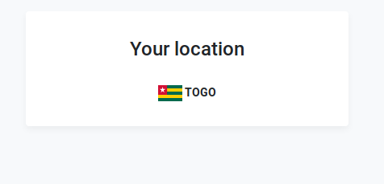

## Get user’s country name and country flag based on his ip address

I have used 3 api to do this project:

1. [jsonapi](https://jsonip.com) to get user’s ip address.
2. [ipapi](https://ipapi.co/) to get the country code based on the ip address return by jsonapi.
3. [restcountries](https://restcountries.eu) to get country name and flag based on the code.

See the [Demo](http://lioncoding.epizy.com/user-location/)